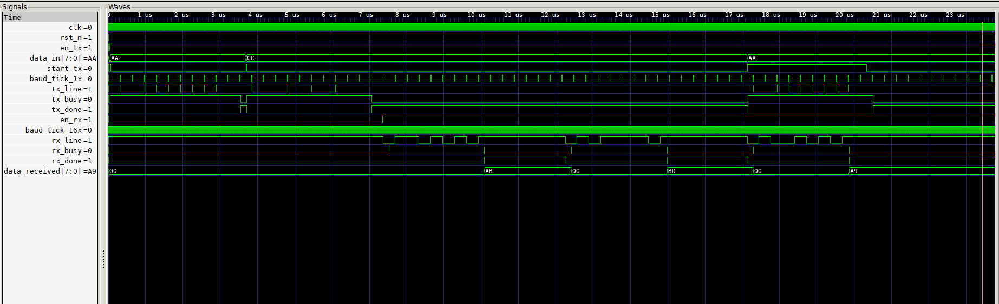

# RTL_UART_FSM

A fully synthesizable UART (Universal Asynchronous Receiver/Transmitter) system designed in Verilog RTL.  
Supports configurable baud rates, 8-bit asynchronous serial communication with 16x oversampling, and modular design for easy simulation and integration.

---

## Features

- 8-bit UART Transmitter and Receiver
- Configurable baud rate via 16-bit divisor input
- 16x oversampling for reliable UART reception
- Modular and testbench-covered design
- Easy simulation with provided Makefile targets

---

## File Structure and Descriptions

```

RTL_UART/
├── baud_gen/
│   ├── baud_gen.v           # Baud rate generator module
│   └── tb_baud.v            # Testbench for baud generator
├── count_comp/
│   ├── comparator.v         # Comparator module for baud timing pulses
│   └── counter.v            # 16-bit counter module
├── Rx_/
│   ├── uart_rx.v            # UART Receiver module
│   └── tb_rx.v              # Testbench for UART Receiver
├── Tx_/
│   ├── uart_tx.v            # UART Transmitter module
│   └── tb_tx.v              # Testbench for UART Transmitter
├── Top_/
│   ├── top.v                # Top-level UART integration module
│   └── tb_top.v             # Full UART system testbench
├── Makefile                 # Simulation and waveform helper commands
└── README.md                # Project documentation

```

---

## Module Descriptions and Interfaces

### 1. `baud_gen/baud_gen.v` — Baud Rate Generator  
Generates baud timing pulses (`baud_tick_1x` and `baud_tick_16x`) using a state machine that monitors count pulses from the comparator and counter.

| Input          | Description                                  |
|----------------|----------------------------------------------|
| `clk`          | System clock                                 |
| `rst_n`        | Active low reset                             |
| `cnt_1x`       | Single baud count pulse                      |
| `cnt_16x`      | 16x baud count pulse                         |

| Output         | Description                                  |
|----------------|----------------------------------------------|
| `clr`          | Counter clear/reset                          |
| `baud_tick_1x` | Baud tick for transmitter timing            |
| `baud_tick_16x`| 16x oversampling tick for receiver timing   |

---

### 2. `count_comp/comparator.v` — Comparator  
Compares counter value with baud divisor to produce timing pulses for baud rate generation.

| Input          | Description                                  |
|----------------|----------------------------------------------|
| `count`        | Current counter value                        |
| `baud_div`     | Baud rate divisor value                      |

| Output         | Description                                  |
|----------------|----------------------------------------------|
| `cnt_1x`       | Pulse when count reaches baud_div - 1        |
| `cnt_16x`      | Pulses at intervals of baud_div / 16          |

---

### 3. `count_comp/counter.v` — Counter  
16-bit synchronous counter that increments every clock cycle and resets on clear or reset.

| Input          | Description                                  |
|----------------|----------------------------------------------|
| `clk`          | System clock                                 |
| `rst_n`        | Active low reset                             |
| `clr`          | Clear/reset counter                          |

| Output         | Description                                  |
|----------------|----------------------------------------------|
| `count`        | Current count value                          |

---

### 4. `Tx_/uart_tx.v` — UART Transmitter  
Finite state machine that serializes 8-bit parallel data with start and stop bits, timed by `baud_tick_1x`.

| Input          | Description                                  |
|----------------|----------------------------------------------|
| `clk`          | System clock                                 |
| `rst_n`        | Active low reset                             |
| `en`           | Enable transmitter                           |
| `start_tx`     | Signal to start transmission                 |
| `data_in`      | 8-bit data input                             |
| `baud_tick_1x` | Baud tick for timing transmission            |

| Output         | Description                                  |
|----------------|----------------------------------------------|
| `tx_busy`      | Transmitter busy indicator                   |
| `tx_done`      | Transmission done flag                       |
| `tx_line`      | UART transmit data line                      |

---

### 5. `Rx_/uart_rx.v` — UART Receiver  
Finite state machine that receives serial data using 16x oversampling, outputs 8-bit data when reception is complete.

| Input          | Description                                  |
|----------------|----------------------------------------------|
| `clk`          | System clock                                 |
| `rst_n`        | Active low reset                             |
| `en`           | Enable receiver                             |
| `rx_line`      | UART receive data line                       |
| `baud_tick_16x`| 16x oversampled baud tick                     |

| Output         | Description                                  |
|----------------|----------------------------------------------|
| `rx_busy`      | Receiver busy indicator                      |
| `rx_done`      | Reception complete flag                      |
| `data_received`| 8-bit received data                          |

---

### 6. `Top_/top.v` — Top-Level UART Module  
Integrates transmitter, receiver, baud generator, counter, and comparator into a single UART module.

| Input          | Description                                  |
|----------------|----------------------------------------------|
| `clk`          | System clock                                 |
| `rst_n`        | Active low reset                             |
| `en_tx`        | Enable transmitter                           |
| `en_rx`        | Enable receiver                             |
| `baud_div`     | Baud rate divisor                            |
| `start_tx`     | Start transmission signal                    |
| `data_in`      | 8-bit data input                             |
| `rx_line`      | UART receive data line                       |

| Output         | Description                                  |
|----------------|----------------------------------------------|
| `tx_busy`      | Transmitter busy flag                        |
| `tx_done`      | Transmission done flag                       |
| `tx_line`      | UART transmit data line                      |
| `baud_tick_16x`| 16x baud tick (internal use)                 |
| `rx_busy`      | Receiver busy flag                           |
| `rx_done`      | Reception done flag                          |
| `data_received`| 8-bit received data                          |

---

## Working Procedure

1. **Clock and Reset Initialization:**  
   The system is driven by a clock input (`clk`) and an active-low reset (`rst_n`). Reset initializes all modules to their default states.

2. **Baud Rate Generation:**  
   The 16-bit `counter` increments each clock cycle until cleared. The `comparator` compares this count to `baud_div` to generate timing pulses `cnt_1x` and `cnt_16x`. These pulses feed into `baud_gen`, which creates precise baud ticks:  
   - `baud_tick_1x` for transmitter timing  
   - `baud_tick_16x` for receiver oversampling timing

3. **Transmission Flow:**  
   When enabled (`en_tx`) and triggered (`start_tx`), the UART transmitter (`uart_tx`) takes 8-bit parallel data (`data_in`), adds start and stop bits, and serializes the bits onto `tx_line`. The process is paced by `baud_tick_1x`. Transmitter status flags `tx_busy` and `tx_done` indicate transmission progress.

4. **Reception Flow:**  
   When enabled (`en_rx`), the UART receiver (`uart_rx`) monitors the `rx_line` for start bits. Using the `baud_tick_16x` oversampled clock, it samples incoming bits, reconstructs the 8-bit data, and sets `rx_done` upon completion. The received byte is available on `data_received`. Receiver status is shown by `rx_busy`.

5. **Top-Level Integration:**  
   The `top` module ties all these pieces together, allowing simultaneous transmission and reception with configurable baud rate.

---
## Build & Run

Clone the repo:
   ```bash
   git clone https://github.com/shifat65/RTL_UART_FSM/
   cd RTL_UART_FSM
---

## Simulation Instructions

### Prerequisites

- Icarus Verilog (`iverilog`, `vvp`)  
- GTKWave (`gtkwave`)

### Makefile Commands

```bash
make baud      # Simulate baud_gen module
make g_baud    # View baud_gen waveform in GTKWave

make tx        # Simulate uart_tx module
make g_tx      # View uart_tx waveform

make rx        # Simulate uart_rx module
make g_rx      # View uart_rx waveform

make top       # Simulate full UART system
make g_top     # View full UART waveform

make clean     # Remove generated files
````

---

## Baud Rate Configuration

* `baud_div` controls the UART baud rate.
* Example: `baud_div = 32` corresponds roughly to 9600 baud at 100 MHz clock.

---

## Sample Output of waveform



**Description:**  
- The `tx_line` shows serial data bits transmitted including start and stop bits.  
- `tx_busy` and `tx_done` flags indicate transmission status.  
- The `rx_line` corresponds to received data serial input.  
- `rx_busy` and `rx_done` flags show reception progress.  
- `data_received` captures the parallel output byte after successful reception.

---

## Author

Syed Shifat

